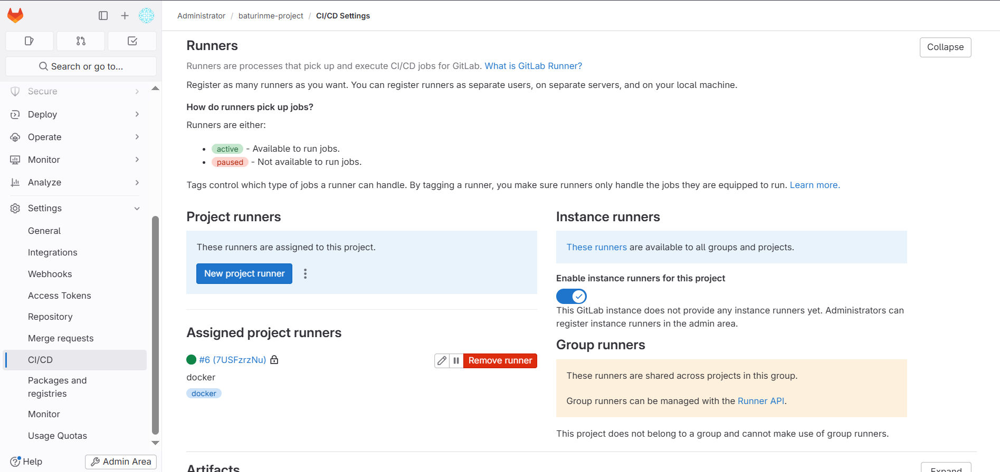
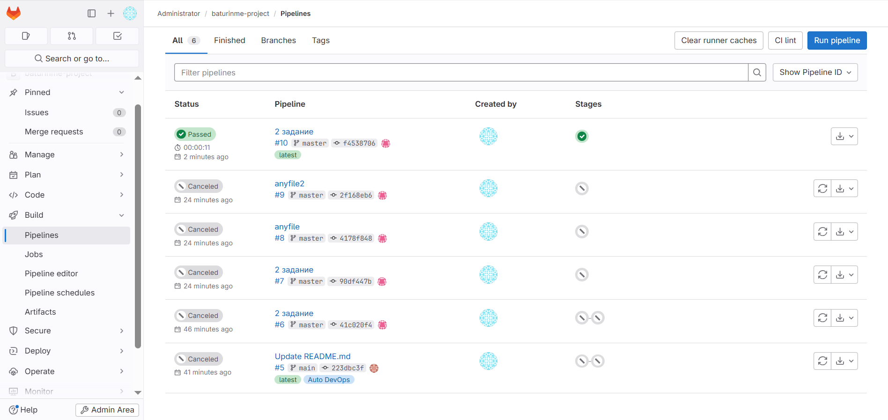

# Домашнее задание к занятию "GitLab" - Батурин Максим

## Задание 1


## Задание 2
### Файл .gitlab-ci.yml
```yaml
stages:
  - test

test:
  stage: test
  tags:
    - docker
  image: alpine:latest
  script:
    - echo ""



